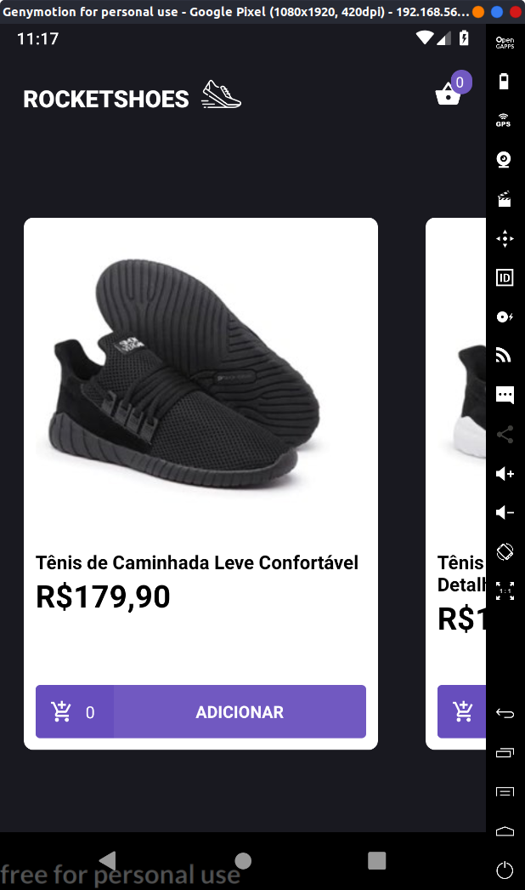

<h1 align="center">
  
  <h1>Rocketshoes</h1>
</h1>

<h2>


</h2>

## 🚀 Tecnologias

Esse projeto foi desenvolvido com as seguintes tecnologias:

- [React Native](https://reactnative.dev/)
- [React Navigation](https://reactnavigation.org/)
- [Redux](https://redux.js.org/)
- [Redux Saga](https://redux-saga.js.org/)
- [Styled Components](https://styled-components.com/)
- [Axios](https://github.com/axios/axios)
- [Reactotron](https://infinite.red/reactotron)
- [VS Code with Editor Config, Eslint and Prettier]()

## 💾 Instalação

```bash
# Clone o repositório
$ git clone https://github.com/rodrigosakamoto/GoStack-rocketshoes-mobile.git

# e em seguida execute:

$ cd GoStack-rocketshoes-mobile
$ yarn
$ yarn react-native run-android
```