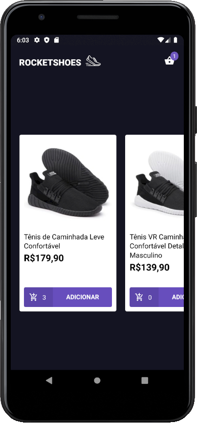

<h1 align="center">
  
</h1>

<h3 align="center">Rocketshoes mobile e-commerce feito em React Native + Redux + Saga.
</h3>

<p align="center">


</p>

## 🚀 Tecnologias

Esse projeto foi desenvolvido com as seguintes tecnologias:

- [React Native](https://reactnative.dev/)
- [React Navigation](https://reactnavigation.org/)
- [Redux](https://redux.js.org/)
- [Redux Saga](https://redux-saga.js.org/)
- [Styled Components](https://styled-components.com/)
- [Axios](https://github.com/axios/axios)
- [Reactotron](https://infinite.red/reactotron)
- [VS Code with Editor Config, Eslint and Prettier]()

## 💾 Instalação

```bash
# Clone o repositório
$ git clone https://github.com/rodrigosakamoto/Rocketshoes-mobile.git

# em seguida execute:

$ cd Rocketshoes-mobile
$ yarn
$ yarn android
$ yarn start
```
---
By [Rodrigo Sakamoto](https://www.linkedin.com/in/rodrigo-sakamoto/)
